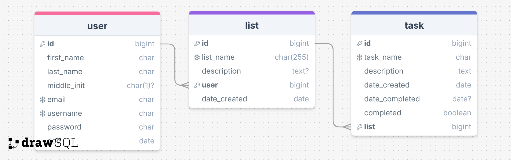

# To Do List API

## 🚀 Overview

The **To-Do List API** is a RESTful backend service built with **Django** and **Django Rest Framework (DRF)**. This API allows users to create and manage task lists, add tasks with due dates, track completion status, and organize their workflow efficiently.  

This project is designed as a **portfolio showcase** to demonstrate back-end API development skills using **Django + DRF**, database design, authentication, and API best practices.

## 🎯 Features

✅ **User Authentication & JWT** – Secure user registration, login, and token-based authentication.  
✅ **CRUD for Lists & Tasks** – Create, update, delete, and retrieve to-do lists and tasks.  
✅ **Task Status Tracking** – Mark tasks as completed, pending, or update due dates.  
✅ **Pagination & Filtering** – Efficient pagination and filtering of tasks based on completion status and due dates.  
✅ **Role-Based Permissions** – Users can only manage their own lists and tasks.  
✅ **Database Optimization** – Indexed queries for faster API responses.  
✅ **RESTful API Design** – Built with DRF following best practices.  
✅ **API Documentation** – Interactive Swagger / Redoc documentation included.  

## 🏗️ Tech Stack

- **Backend:** Django, Django Rest Framework (DRF)  
- **Database:** PostgreSQL  
- **Authentication:** JWT (django-rest-framework-simplejwt)  
- **Containerization:** Docker, Docker Compose  
- **Testing:** Django TestCase, DRF APITestCase  
- **Documentation:** Swagger (`drf-yasg`)

## [⚙️ Installation & Setup](./docs/installation-setup.md)

## [📜 API Endpoints](./docs/api-endpoints.md)

## [🧪 Running Tests](./docs/running-tests.md)

## [🚀 Deployment](./docs/deployment.md)

## 📖 API Documentation

- **MkDocs:** `http://127.0.0.1:8000/mkdocs/`

## 🤝 Contributing

Feel free to fork this repository and submit pull requests! 🚀  

## 📜 License

This project is open-source and available under the **MIT License**.  

## 💡 **Author:** Francisco Avila | [GitHub](https://github.com/fravila08) | [LinkedIn](https://www.linkedin.com/in/francisco-r-avila)  
